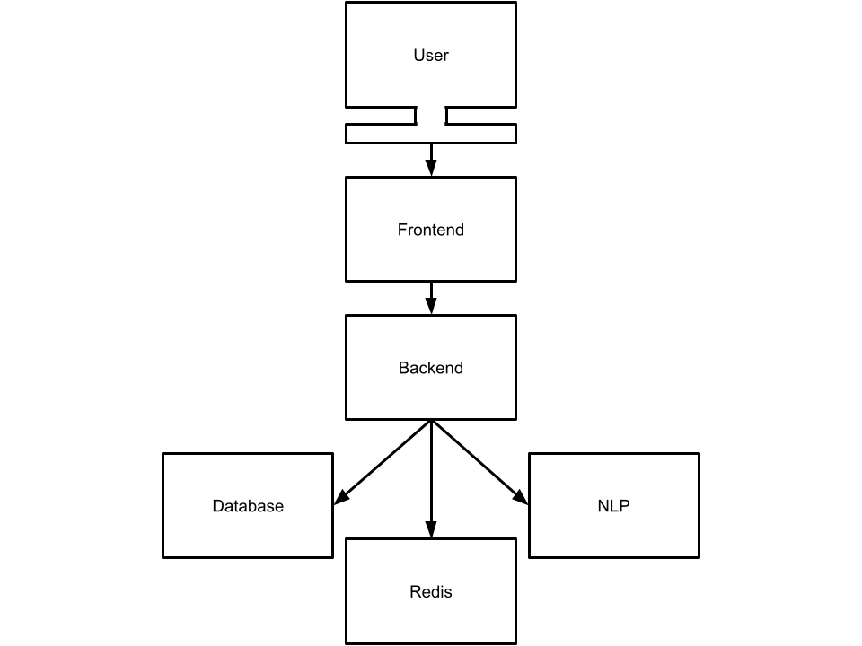
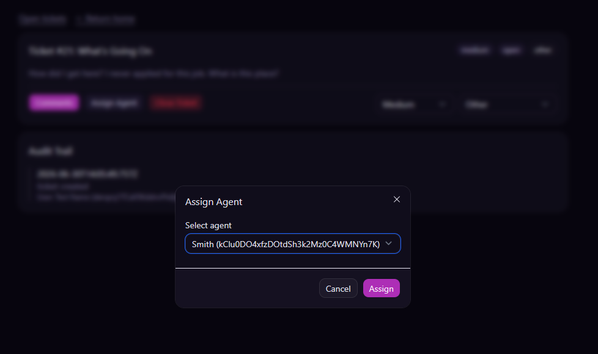
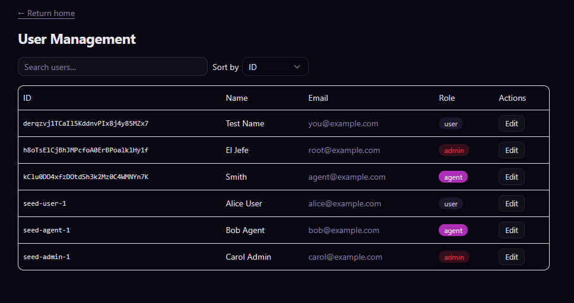
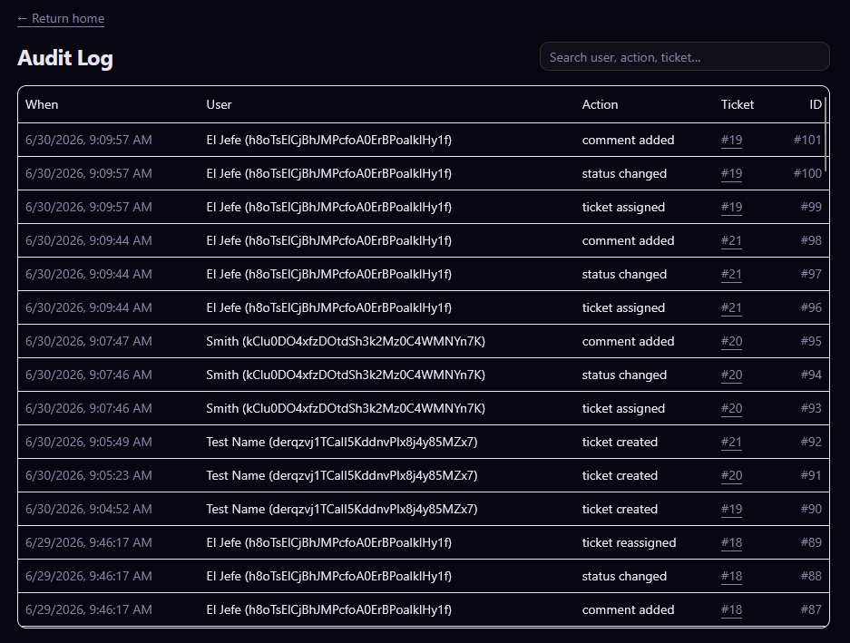
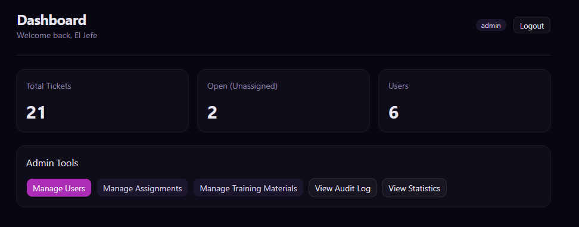
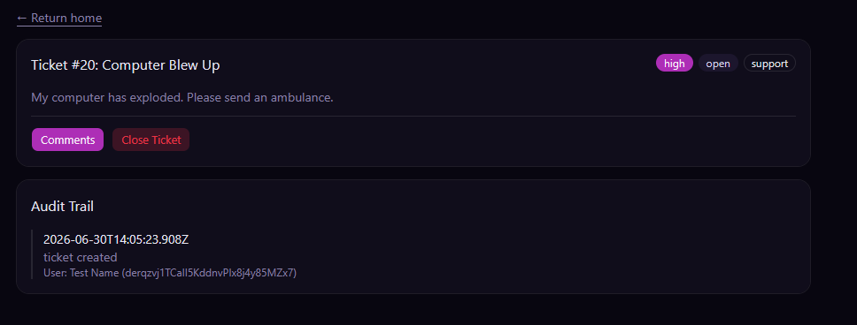
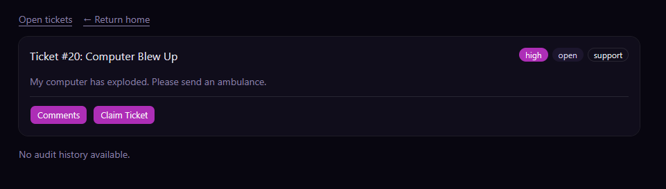
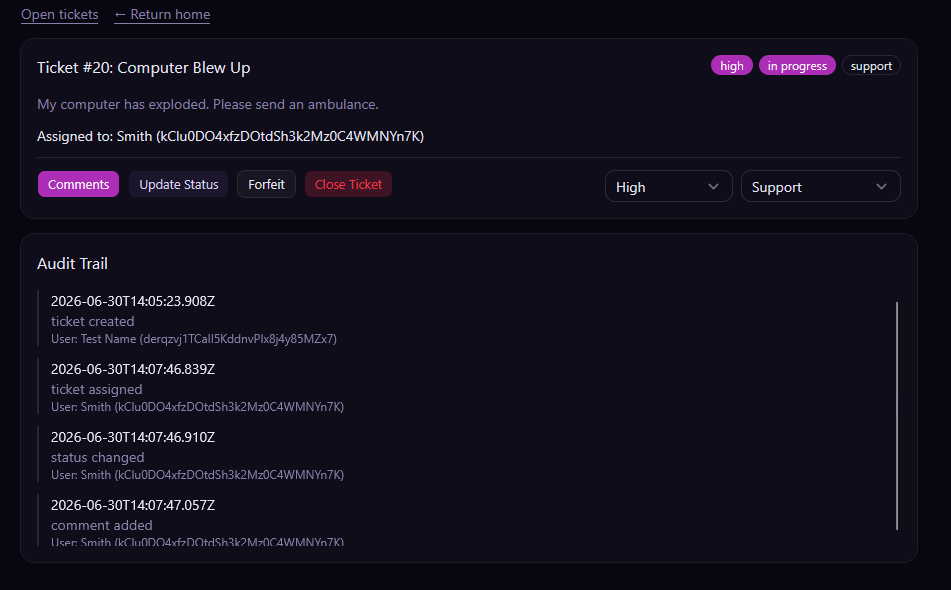
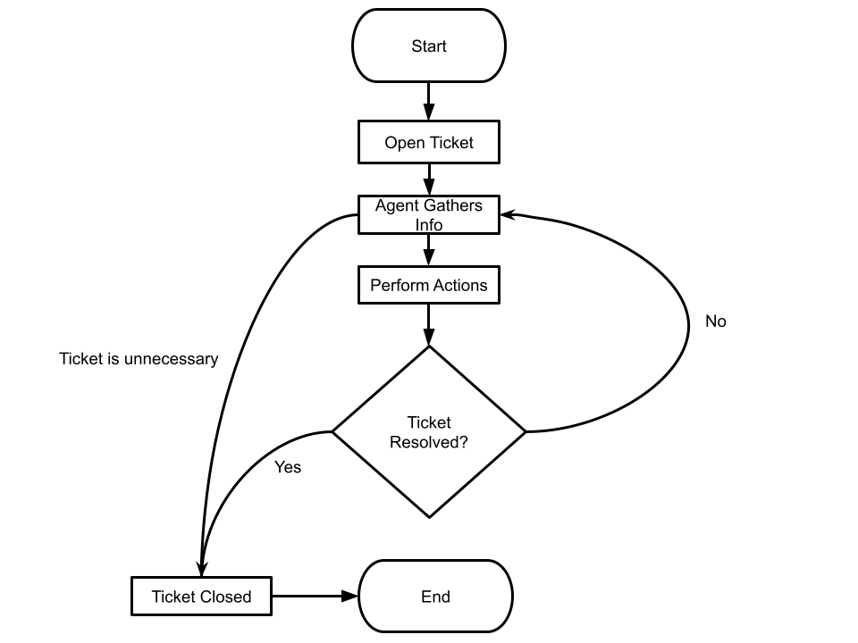

# Architecture

Technical reference for how Ticket System is built: the stack, directory layout, database schema, auth flow, rate limiting, API surface, ticket workflow, and NLP service internals.



<details>
<summary><strong>Table Of Contents</strong></summary>
<ol>
  <li><a href="#stack">Stack</a></li>
  <li><a href="#directory-structure">Directory Structure</a></li>
  <li><a href="#database-schema">Database Schema</a></li>
  <li><a href="#database-permissions">Database Permissions</a></li>
  <li><a href="#auth-flow">Auth Flow</a></li>
  <li><a href="#rate-limiting">Rate Limiting</a></li>
  <li><a href="#dashboard-caching">Dashboard Caching</a></li>
  <li>
    <a href="#api-reference">API Reference</a>
    <ul>
      <li><a href="#dashboard">Dashboard</a></li>
      <li><a href="#auth">Auth</a></li>
      <li><a href="#tickets">Tickets</a></li>
      <li><a href="#admin">Admin</a></li>
      <li><a href="#settings">Settings</a></li>
      <li><a href="#notifications">Notifications</a></li>
      <li><a href="#training-materials">Training Materials</a></li>
    </ul>
  </li>
  <li>
    <a href="#workflow">Workflow</a>
    <ul>
      <li><a href="#user-roles">User Roles</a></li>
      <li><a href="#ticket-lifecycle">Ticket Lifecycle</a></li>
    </ul>
  </li>
  <li>
    <a href="#nlp-service">NLP Service</a>
    <ul>
      <li><a href="#how-it-works">How It Works</a></li>
      <li><a href="#model-setup">Model Setup</a></li>
      <li><a href="#endpoint">Endpoint</a></li>
    </ul>
  </li>
</ol>
</details>

## Stack

| Layer       | Technology                                                                                                                                                                                                                |
| ----------- | ------------------------------------------------------------------------------------------------------------------------------------------------------------------------------------------------------------------------- |
| Frontend    | [SvelteKit](https://kit.svelte.dev/) 5, [Svelte](https://svelte.dev/) 5, [Tailwind CSS](https://tailwindcss.com/) 4                                                                                                       |
| Backend     | [SvelteKit](https://kit.svelte.dev/) 5 (API routes only)                                                                                                                                                                  |
| NLP service | [FastAPI](https://fastapi.tiangolo.com/), [Hugging Face Transformers](https://huggingface.co/docs/transformers) ([`facebook/bart-large-mnli`](https://huggingface.co/facebook/bart-large-mnli), zero-shot classification) |
| Auth        | [Better Auth](https://better-auth.com/) 1.6 (HTTP-only cookie sessions, PostgreSQL session store, Redis session cache)                                                                                                    |
| ORM         | [Drizzle ORM](https://orm.drizzle.team/) 0.45                                                                                                                                                                             |
| Database    | [PostgreSQL](https://www.postgresql.org/) 16                                                                                                                                                                              |
| Cache       | [Redis](https://redis.io/) 7 (Better Auth secondary storage, session token cache, rate limiting, and dashboard/settings caching)                                                                                          |

## Directory Structure

```
ticket-system/
├── frontend/                        # SvelteKit UI app
│   └── src/
│       ├── auth/                    # Better Auth client config
│       ├── config/                  # env.ts: typed env vars
│       ├── db/                      # Drizzle client (read-only queries for SSR)
│       ├── lib/
│       │   └── components/          # Shared Svelte components (TicketCard, NotificationBell,
│       │                            # RelativeTime, StatCard, ui/ primitives, etc.)
│       ├── middleware/              # SvelteKit hooks (session validation)
│       ├── routes/                  # File-based pages
│       │   ├── +layout.svelte       # Root layout (site icon, notification bell, theme toggle)
│       │   ├── auth/                # login, logout, register pages
│       │   ├── tickets/             # ticket list and detail pages
│       │   ├── create_ticket/       # ticket creation page (calls NLP service for suggestion)
│       │   ├── training/            # training material list and detail pages
│       │   └── admin/               # admin dashboard, stats, users, audit, settings, training mgmt
│       └── types/                   # Shared TypeScript types
│
├── backend/                         # SvelteKit API-only app
│   ├── training-materials/          # Markdown files served as training content
│   └── src/
│       ├── auth/                    # Better Auth server config + Redis session store
│       ├── config/                  # env.ts: typed env vars
│       ├── db/                      # Drizzle ORM schema + client
│       │   └── schema.ts            # tickets, comments, users, notifications, app_settings, etc.
│       ├── lib/                     # Redis client, cache helpers, dashboard cache TTL/keys,
│       │                            # admin settings, rate limiter, deleted-user placeholder
│       ├── middleware/              # sessionValidator: reads cookie, populates locals.user
│       ├── routes/                  # API endpoints (+server.ts files)
│       │   ├── auth/                # register, login, logout, me
│       │   ├── tickets/             # ticket CRUD and actions
│       │   ├── create_ticket/       # ticket creation endpoint
│       │   ├── training/            # training material listing and content
│       │   ├── settings/            # public read of admin-configurable settings
│       │   ├── notifications/       # per-user notification list, unread count, mark read
│       │   └── admin/               # user management, audit log, stats, settings
│       └── types/                   # Shared TypeScript types
│
└── nlp_service/                     # FastAPI NLP microservice
    ├── main.py                      # /suggest endpoint: zero-shot priority classification
    ├── requirements.txt             # Python dependencies
    └── local_model/                 # facebook/bart-large-mnli weights (not in git)
```

## Database Schema

**Business tables** (defined in `backend/src/db/schema.ts`)

| Table                | Description                                                                                    |
| -------------------- | ------------------------------------------------------------------------------------------------ |
| `userTable`          | email, password hash, role (`user` / `agent` / `admin`), `active` flag (deactivated accounts)   |
| `ticketsTable`       | title, description, status, priority, category, creator, assignee                              |
| `commentsTable`      | content, ticket FK, user FK, `isAutomated` flag (system-generated vs. human comments)           |
| `assignmentsTable`   | ticket-to-user assignment records                                                               |
| `auditEventsTable`   | action type, ticket FK, user FK, timestamp, optional display name                               |
| `notificationsTable` | per-user notification: message, optional link, `read` flag, timestamp                           |
| `appSettingsTable`   | singleton row (id `1`) of admin-configurable runtime settings &mdash; see [Settings](#settings) |

**The `[deleted user]` placeholder** (`backend/src/lib/deletedUser.ts`, fixed id `deleted-user`) is a real row in `userTable` with no linked `account`/`session`, so it can never log in. When an admin deletes a user, their tickets (as creator or assignee), comments, and audit events are reassigned to this placeholder instead of being orphaned, and any of their tickets not already `closed` are automatically closed. This keeps historical records (and the FK constraints backing them) intact after the original account is gone. The placeholder is excluded from the admin user list and the "Total Users" stat.

**Training materials** are stored as Markdown files in `backend/training-materials/`, not in the database. Served via the `/training` API. Slugs are derived from filenames.

**Auth tables** (managed by Better Auth): `user`, `session`, `account`, `verification`

<!-- DATABASE PERMISSIONS -->

## Database Permissions

The application's runtime database role (`DATABASE_URL` in `backend/.env`) is intentionally limited to row-level operations &mdash; `SELECT` / `INSERT` / `UPDATE` / `DELETE` &mdash; on every table, with **no schema-modifying privileges** (`CREATE`, `ALTER`, `DROP`). This means:

- The app itself can never accidentally (or via a compromised dependency) alter a table, create a new one, or drop something in production.
- Running `drizzle-kit generate`/`drizzle-kit migrate` (or any other DDL) requires a **separate, privileged Postgres connection** &mdash; typically the `postgres` superuser role, not the app's normal connection string.
- `ALTER DEFAULT PRIVILEGES FOR ROLE <migration-role> IN SCHEMA public GRANT SELECT, INSERT, UPDATE, DELETE ON TABLES ...` (and the equivalent for sequences) is set up so that any **new** table created by the migration role automatically grants the app role row-level access &mdash; no manual `GRANT` needed after each migration.

If you're setting this up from scratch, running migrations with the same role the app uses at runtime is simpler and works fine for local development. This separation matters most in production, where you don't want the app's own credentials capable of altering its own schema.

<!-- AUTH FLOW -->

## Auth Flow

Better Auth handles password hashing, session creation, and session validation. The custom routes (`/auth/register`, `/auth/login`, etc.) are thin wrappers that add input validation and shape the JSON response.

1. **Registration**: `POST /auth/register` validates the input, then delegates to Better Auth's `signUpEmail()`. Better Auth hashes the password and writes a record to the `user` table and a credential record to the `account` table. A session is created and a `sessionId` HTTP-only cookie is returned.
2. **Login**: `POST /auth/login` validates the input, then delegates to Better Auth's `signInEmail()`. Better Auth verifies the password hash and writes a new session record to the `session` table in PostgreSQL. Since Better Auth has no concept of the app's custom `active` flag, the login route additionally checks `userTable.active` after a successful authentication and rejects with `403` ("This account has been deactivated.") before ever setting the cookie. The `sessionId` cookie is set on the response otherwise.
3. **Request validation**: A global SvelteKit hook runs on every backend request. It calls Better Auth's `getSession()`, which reads the `sessionId` cookie and validates it first against the Redis session cache, falling back to the PostgreSQL `session` table on a cache miss. If valid, the hook fetches the user's `role` and `active` flag from `userTable`. A deactivated user has `event.locals.user` set to `null` regardless of session validity &mdash; they're treated as logged out on their very next request, without needing to forcibly revoke the underlying session. Endpoints check `locals.user.role` to enforce access control.
4. **Logout**: `POST /auth/logout` delegates to Better Auth's `signOut()`, which deletes the session record from PostgreSQL and clears the cookie.
5. **Session storage**: Sessions are stored in PostgreSQL (the `session` table) as the source of truth. Active session tokens are also cached in Redis via Better Auth's `secondaryStorage` interface, so most `getSession()` calls are served from Redis without a database round-trip. Each session record includes `expiresAt` (3-day TTL), `ipAddress`, and `userAgent`.

<!-- RATE LIMITING -->

## Rate Limiting

The backend's global SvelteKit hook (`hooks.server.ts`) applies a Redis-backed fixed-window rate limit, keyed by client IP, before any auth or session checks run:

| Route(s)                                  | Limit             |
| ----------------------------------------- | ----------------- |
| `POST /auth/login`, `POST /auth/register` | 10 requests / 10s |
| `POST /create_ticket`                     | 30 requests / 60s |

Requests over the limit receive a `429` response with a `Retry-After` header indicating how many seconds until the window resets. The limiter logic lives in `backend/src/lib/rateLimit.ts` and is unit tested independently of Redis via an in-memory fake store.

<!-- DASHBOARD CACHING -->

## Dashboard Caching

The endpoints backing every dashboard-style view &mdash; `GET /` (homepage stats), `GET /tickets` (admin branch), `GET /admin/users`, and `GET /admin/audit` &mdash; are cached in Redis via `getOrSetCache`/`invalidateCache` (`backend/src/lib/cache.ts`) instead of hitting Postgres on every request.

- **Fail-open**: if Redis is unreachable, cache reads/writes fail silently and the handler falls straight through to the database rather than 500ing.
- **TTL is admin-configurable**: the cache duration isn't a hardcoded constant &mdash; `getDashboardCacheTtlSeconds()` (`backend/src/lib/dashboardCache.ts`) reads it from [`appSettingsTable`](#database-schema) (via the same Redis-cached settings layer, see [Settings](#settings)) on every call, so changing it in the admin UI takes effect within one cache cycle with no redeploy.
- **Cache keys** are scoped per role/user where the underlying data differs by caller (e.g. `dashboard:home:user:<userId>`, `dashboard:home:agent:<userId>`), and shared where it doesn't (e.g. `dashboard:tickets:admin`, `dashboard:users`, `dashboard:audit`).
- **Invalidation** is centralized at the choke points every mutation already flows through: `POST /admin/audit` (which nearly every ticket mutation calls internally to log an event) invalidates the relevant ticket/audit/home caches for the affected users, and `admin/users` routes invalidate the users cache on role changes, deactivation, or deletion.

<!-- API REFERENCE -->

## API Reference

All endpoints live in `backend/src/routes/` as `+server.ts` files. Responses are JSON. The frontend calls these via `BACKEND_URL`.

### Dashboard

| Method | Path | Description                                                                                                                                | Auth required |
| ------ | ---- | -------------------------------------------------------------------------------------------------------------------------------------------- | -------------- |
| `GET`  | `/`  | Role-scoped dashboard data: the caller's tickets by status (user), assigned open tickets (agent), or aggregate ticket/user counts (admin) | No             |

### Auth

| Method | Path             | Description                                    | Auth required |
| ------ | ---------------- | ---------------------------------------------- | ------------- |
| `POST` | `/auth/register` | Register a new user (email, password >8 chars) | No            |
| `POST` | `/auth/login`    | Login; sets `sessionId` cookie                 | No            |
| `POST` | `/auth/logout`   | Clear session cookie                           | Yes           |
| `GET`  | `/auth/me`       | Return the current user's session info         | Yes           |

### Tickets

| Method | Path                     | Description                                   | Auth required |
| ------ | ------------------------ | --------------------------------------------- | ------------- |
| `GET`  | `/tickets`               | List tickets (scoped by role)                 | Yes           |
| `POST` | `/create_ticket`         | Create a new ticket                           | Yes (user+)   |
| `GET`  | `/tickets/[id]`          | Get a single ticket                           | Yes           |
| `POST` | `/tickets/[id]`          | Update ticket status, assignment, or metadata | Yes (agent+)  |
| `GET`  | `/tickets/[id]/status`   | Get ticket status                             | Yes           |
| `GET`  | `/tickets/[id]/comments` | List comments on a ticket                     | Yes           |
| `POST` | `/tickets/[id]/comments` | Add a comment (blocked if closed)             | Yes           |
| `GET`  | `/tickets/open`          | List all open tickets                         | Yes (agent+)  |

#### `POST /tickets/[id]` actions

The body must include an `action` field:

| `action`          | Who          | Description                                                                                            |
| ----------------- | ------------ | ------------------------------------------------------------------------------------------------------ |
| `claim`           | Agent        | Assign ticket to self; sets status → `in_progress`                                                     |
| `forfeit`         | Agent        | Remove self-assignment; sets status → `open`                                                           |
| `close`           | Agent, Admin | Close the ticket                                                                                       |
| `update_status`   | Agent        | Change status (`open` / `in_progress` / `waiting_for_response` / `resolved`); agent must be assigned   |
| `update_metadata` | Agent, Admin | Change `priority` and/or `category`; ticket must not be `closed` or `resolved`; agent must be assigned |
| `assign`          | Admin        | Assign ticket to any agent; sets status → `in_progress`                                                |
| `unassign`        | Admin        | Remove assignment; sets status → `open`                                                                |

### Admin

| Method   | Path                | Description                                                                                                | Auth required |
| -------- | ------------------- | ------------------------------------------------------------------------------------------------------------- | -------------- |
| `GET`    | `/admin/users`      | List all users (excludes the `[deleted user]` placeholder)                                                  | Admin          |
| `POST`   | `/admin/users`      | Change a user's role                                                                                         | Admin          |
| `GET`    | `/admin/users/[id]` | Get a user by id (name only for non-admins; full record for admins)                                         | Yes            |
| `PATCH`  | `/admin/users/[id]` | Set `{ active: boolean }` to activate/deactivate a user (cannot target self or the placeholder)              | Admin          |
| `DELETE` | `/admin/users/[id]` | Delete a user (cannot delete self or the placeholder). Reassigns their tickets/comments/audit events to the `[deleted user]` placeholder, closes any of their tickets not already closed, and drops their notifications, so deletion always succeeds instead of being blocked by foreign-key references | Admin          |
| `GET`    | `/admin/audit`      | Get audit events (filterable by ticket)                                                                     | Admin          |
| `POST`   | `/admin/audit`      | Log an audit event. This is the choke point nearly every ticket mutation flows through, so it also invalidates the relevant [dashboard caches](#dashboard-caching) and creates [notifications](#notifications) for affected users | Admin          |

Aggregate ticket and user statistics are returned by `GET /` (see [Dashboard](#dashboard)) rather than a dedicated `/admin/stats` endpoint.

### Settings

Runtime-configurable behavior (site icon, NLP suggestion debounce, dashboard cache TTL) is stored in [`appSettingsTable`](#database-schema) and managed via `backend/src/lib/settings.ts`, which reads through a Redis cache (30s TTL, fail-open) and invalidates on write.

| Method | Path              | Description                                                                                          | Auth required |
| ------ | ----------------- | -------------------------------------------------------------------------------------------------- | -------------- |
| `GET`  | `/settings`       | Public subset needed by any page: `{ siteIconUrl, nlpDebounceMs }`                                  | No             |
| `GET`  | `/admin/settings` | Full settings object, including `dashboardCacheTtlSeconds`                                          | Admin          |
| `PUT`  | `/admin/settings` | Update any subset of `{ siteIconUrl, nlpDebounceMs, dashboardCacheTtlSeconds }`                      | Admin          |

`/settings` is public (no auth) because the site icon renders in the header for guests too, and `create_ticket` needs the debounce value regardless of role. `dashboardCacheTtlSeconds` is intentionally excluded from the public response since it's an internal operational knob.

The admin UI for this lives at `/admin/settings` in the frontend.

### Notifications

Per-user notifications are created as a side effect of `POST /admin/audit` (see [Admin](#admin)) for actions relevant to a specific user: `ticket assigned` notifies the new assignee, `status changed` notifies the ticket creator, and `comment added`/`ticket updated` notify whichever of creator/assignee isn't the one who acted.

| Method | Path                          | Description                                                | Auth required |
| ------ | ----------------------------- | ----------------------------------------------------------- | -------------- |
| `GET`  | `/notifications`              | List the current user's most recent notifications (max 30) | Yes            |
| `GET`  | `/notifications/unread-count` | Count of the current user's unread notifications            | Yes            |
| `POST` | `/notifications/[id]/read`    | Mark one notification as read                                | Yes            |
| `POST` | `/notifications/read-all`     | Mark all of the current user's notifications as read         | Yes            |

The frontend's `NotificationBell` component (in the header, shown only when logged in) polls `unread-count` every 30 seconds and fetches the full list when opened.

### Training Materials

Training materials are Markdown files stored in `backend/training-materials/`. Agents can read them; only admins can write.

| Method   | Path               | Description                                | Auth required |
| -------- | ------------------ | ------------------------------------------ | ------------- |
| `GET`    | `/training`        | List all training materials (slug + title) | Agent, Admin  |
| `POST`   | `/training`        | Create a new training material             | Admin         |
| `GET`    | `/training/[slug]` | Get content of a training material         | Agent, Admin  |
| `PUT`    | `/training/[slug]` | Update content of a training material      | Admin         |
| `DELETE` | `/training/[slug]` | Delete a training material                 | Admin         |

`POST /training` body: `{ title: string, content: string }`. The slug is derived from the title (lowercase alphanumeric + hyphens). Returns `{ slug }` on success.

`PUT /training/[slug]` body: `{ content: string }` (title is not updated; rename by delete + create).

<details>
<summary>Screenshots</summary>


*Admin view of an individual ticket, showing full metadata and controls.*



*Dialog for an admin to assign a ticket to a specific agent.*



*Admin user management page, listing all users and their roles.*



*Admin audit log showing all recorded ticket and user actions.*


*Admin stats dashboard showing ticket volume and agent performance.*


*Training material list as seen by an agent.*

</details>

<!-- WORKFLOW -->

## Workflow

### User Roles

| Role      | Capabilities                                                                                                                                     |
| --------- | ------------------------------------------------------------------------------------------------------------------------------------------------ |
| **User**  | Create tickets, view and comment on own tickets, close own tickets                                                                               |
| **Agent** | View open/assigned tickets, claim and forfeit tickets, update ticket status and metadata (priority/category), comment, access training materials |
| **Admin** | Full access: all tickets (sortable/searchable by reporter or assignee), user management (roles, activate/deactivate, delete), assignments, audit log, stats dashboard, notifications, app settings, manage training materials |

Deactivated users (`userTable.active = false`) keep their account and history but are rejected at login and treated as logged out on every request &mdash; see [Auth Flow](#auth-flow). This is distinct from deletion, which removes the account entirely and reassigns their records to the [`[deleted user]` placeholder](#database-schema).

### Ticket Lifecycle

1. A **user** creates a ticket with a title, description, priority, and category.
2. An **agent** claims the ticket (status &rarr; `in_progress`) or it can be assigned by an **admin**.
3. The agent works the ticket, adding comments and updating status.
4. Status can progress through: `open` &rarr; `in_progress` &rarr; `waiting_for_response` &rarr; `resolved` &rarr; `closed`.
5. A ticket can hit `in_progress` and `waiting_for_response` multiple times before continuing to `resolved`.
6. Once `closed`, no further comments can be added.

Every status/assignment change also posts a system-generated comment (e.g. "Ticket claimed", "Ticket status updated to resolved") flagged with `commentsTable.isAutomated = true`. The frontend renders these as a compact, muted, icon-labeled line instead of a full comment card, so they're easy to skim past when scanning for actual replies. The relevant assignee/creator is notified for these actions via the [notifications](#notifications) system.

**Priorities**: `low` | `medium` | `high` | `critical`

**Categories**: `bug` | `feature_request` | `support` | `other`

<details>
<summary>Screenshots</summary>


*Dashboard view for a regular user, showing their submitted tickets.*


*Dashboard view for an agent, showing open and assigned tickets.*



*Dashboard view for an admin, with access to all tickets and management tools.*


*A user's list of their own tickets.*



*A ticket detail page as seen by the user who created it.*



*An unclaimed ticket as seen by an agent, before it's been claimed.*



*A ticket that's been claimed, as seen by the agent working it.*



*Diagram of the ticket status lifecycle from open to closed.*

</details>

<!-- NLP SERVICE -->

## NLP Service

The NLP service exposes a single endpoint used by the ticket creation form to suggest a priority level before the user submits.

### How It Works

1. As the user types in the description field (after 20+ characters), the frontend waits for a debounce period (default 600 ms, admin-configurable via [Settings](#settings) as `nlpDebounceMs`) then sends the title and description to `POST http://localhost:8000/suggest`.
2. The service runs zero-shot classification against four natural-language label descriptions (one per priority level) using `facebook/bart-large-mnli`.
3. The top-scoring label is returned as a priority string (`low` / `medium` / `high` / `critical`) along with a confidence score. If `critical` is the top label but its score is below `0.5`, it's discarded in favor of the second-highest label, so a low-confidence "critical" never reaches the user.
4. The priority dropdown is pre-filled with the suggestion and a confidence note is shown. The user can override it freely before submitting.
5. If the service is unreachable, the form falls back silently and the user just picks priority manually.

### Model Setup

The model is **not included in the repository** (weights are large and gitignored). You have two options:

**Option A: let the service download it automatically**

Start the service without a `local_model/` folder present. `main.py` will detect the missing directory, download `facebook/bart-large-mnli` from Hugging Face, and save it to `nlp_service/local_model/`. Requires an internet connection on first run only.

**Option B: download ahead of time**

Run `fetchmodel.py` from the repo root to fetch the weights before starting the service. It uses the `nlp_service/.venv` set up by `dependencies.py` (or manual install), so no need to activate anything first:

```bash
python3 fetchmodel.py
```

Either way, the final path should be `nlp_service/local_model/` containing the model config and weights.

### Endpoint

`POST /suggest`

Request body:

```json
{ "text": "string" }
```

Response:

```json
{ "priority": "medium", "score": 0.842 }
```

Returns `{ "priority": null, "score": 0.0 }` if the input is empty.

<details>
<summary>Screenshots</summary>


*Ticket creation form with the NLP-suggested priority and confidence score shown.*

</details>
